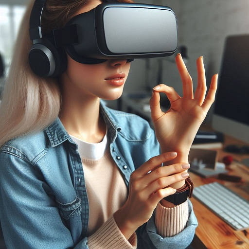

# Assigning Commands to Finger Movements Using MediaPipe Hands
---
## 1-) What is the hand traking:

Hand tracking is a technology that allows a computer or other device to detect and follow the movements of a human hand in real time. This involves recognizing the hand's position, orientation, and individual finger positions, often translating these into digital signals that can be used for various applications.

[link here] (https://google.github.io/mediapipe/images/mobile/hand_crops.png)

### a) Technologies Involved
Computer Vision:
Using cameras to capture images or video of the hand.
Algorithms process these images to identify and track hand movements.

Machine Learning:
Training models to recognize the hand and its landmarks under various conditions and angles.

Sensors:
In some systems, additional sensors (like depth sensors or motion sensors) may be used to improve accuracy.

### b) Applications

Gesture Control:
Controlling devices (like computers, smart TVs, and VR/AR systems) with hand gestures.

Sign Language Interpretation:
Translating sign language into text or speech.

Human-Computer Interaction:
Enhancing user interfaces with natural hand movements.

Gaming and Virtual Reality:
Enabling immersive experiences where users can interact with virtual environments using their hands.

Robotics:
Controlling robots or robotic arms with hand movements.

## 2-) My Aim:
The aim of my code is to use the MediaPipe library to detect and track hand landmarks in real-time using a webcam feed. It also measures the distance between the tip of the thumb and the index finger, and if they are close together for more than 1 seconds, it triggers an action to turn off the camera.

Here’s a brief overview of how it works:

Hand Detection:
Detects the presence of a hand in the image.

Hand Landmark Model:
Identifies 21 landmarks on each detected hand.

Real-Time Processing:
Uses efficient algorithms to process video frames in real time, enabling smooth tracking of hand movements.

